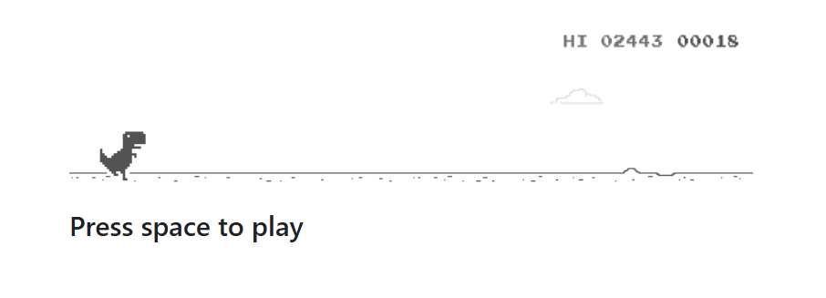
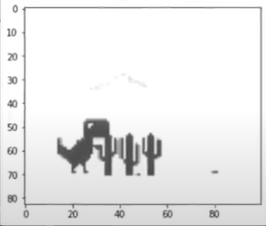
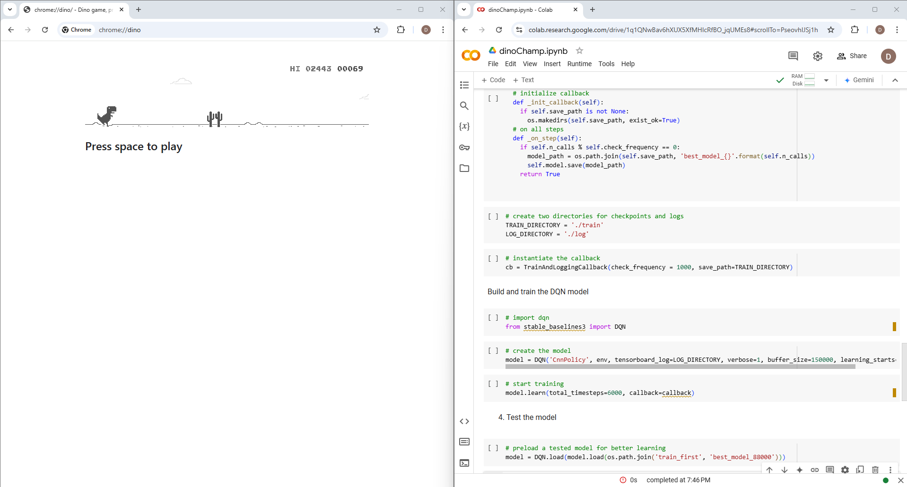

# DinoChamp

DinoChamp is an AI-powered application that trains and deploys an agent to play the Chrome Dino game autonomously. By leveraging cutting-edge tools and libraries, DinoChamp showcases an intelligent agent capable of navigating the game environment with remarkable precision and efficiency.

## Features

- **Frame Capture:** Utilizes `mss` to capture every frame of the screen, providing real-time situational awareness of the game environment.
- **Text Recognition:** Employs `OpenCV` and `pytesseract` to recognize on-screen text, effectively detecting game-over messages.
- **Reinforcement Learning:** Leverages `Stable-Baselines3` to train the agent using a reinforcement learning algorithm.
- **Pretrained Model:** Includes a pretrained model in the repository, optimized over 75,000 instances of the Dino game for robust performance.

## Workflow

1. **Screen Capture:** Frames are captured using `mss`, providing a live feed of the game.
2. **Text Detection:** `OpenCV` and `pytesseract` evaluate text elements, ensuring smooth transitions and detecting game-ending conditions.
3. **Training and Inference:** The agent is trained with `Stable-Baselines3` and utilizes the pretrained model for immediate deployment.

## Repository Structure

- `/images`: Contains example screenshots demonstrating the agent's performance and workflow.
- `/models`: Stores the pretrained model.
- `/src`: Contains the main source code and scripts.

## Screenshots

1.   
   _The dino game_

2.   
   _The frame with the game over text_

3.   
   _A slice of the frame using css_

4.   
   _A screenshot of the model actually training in real time_

## Prerequisites

- Python 3.8+
- Libraries: `mss`, `opencv-python`, `pytesseract`, `stable-baselines3`

## Installation

1. Clone the repository:
   ```bash
   git clone https://github.com/your-repo-name/dinoChamp.git
   cd dinoChamp
   ```
